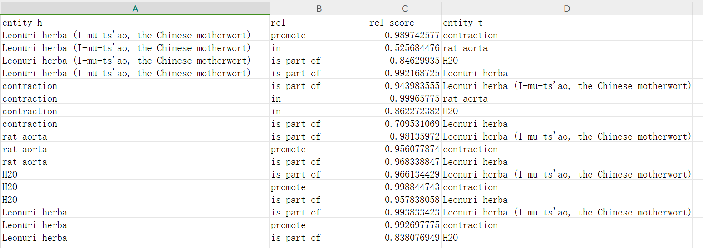

# 信息抽取的流水线方式的实现

## NER

使用**BERT-BiLSTM-CRF**实现
下载后放入pretrained_bert_models目录下即可

## RE

使用opennre包并编写了推理模块，模型位于RE/ckpt下，可以选择bert或者pcnn作为编码器

**由于数据集是使用PubMed中的论文标注的，所以两个任务中Bert使用的都是pubmedbert-base-uncased**

经过对比发现效果会比bert-base-uncased好。

## 模型下载
预训练模型下载链接：https://huggingface.co/microsoft/BiomedNLP-BiomedBERT-base-uncased-abstract-fulltext

训练好的NER和RE模型下载链接：https://pan.baidu.com/s/1qLLQ-nsCqCUGI8T8ggN6gQ?pwd=1234

## 运行
下载了相应的预训练模型后，只需简单调用 


| NER_f1 | RE_f1 | 
|--------|-------|
| 0.791  | 0.923 | 


```
cd pipeline_ie

python pipeline.py
```
模型名称、路径等参数位于config.py模块下。

首先会加载NER/model/ckpt下的NER模型以及RE/ckpt下的RE模型后

对文本输入NER模型识别出所有实体后形成entity_list
然后将entity_list输入RE模型进行关系分类，选择关系得分>0.7的三元组进行保留。

最终结果将写入**pred_res**目录下：
